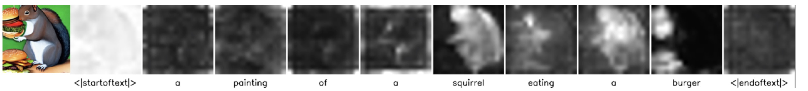
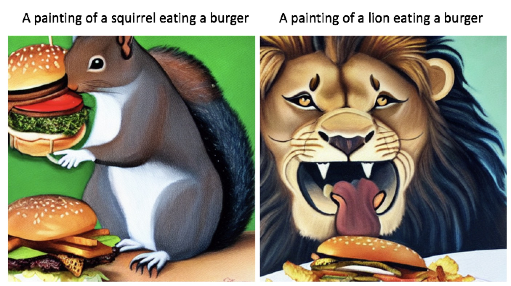
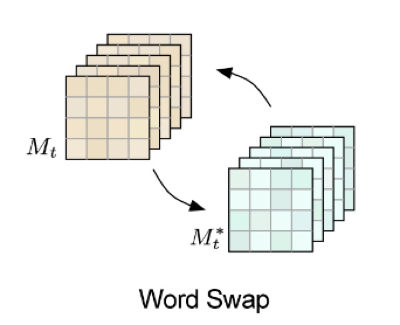
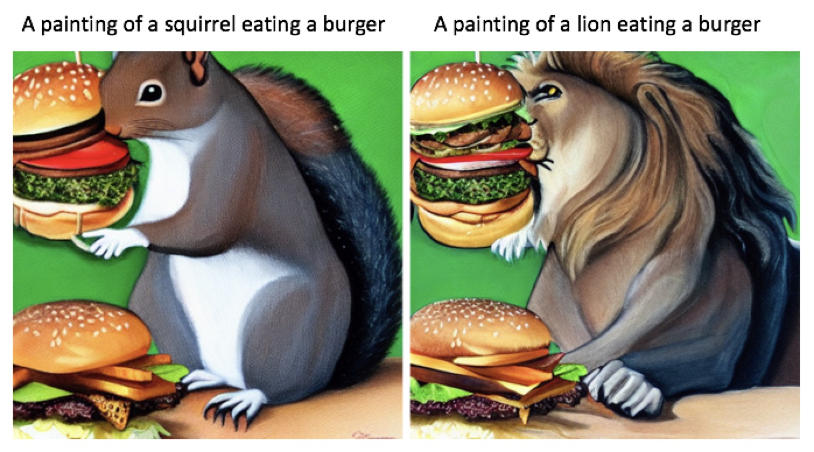
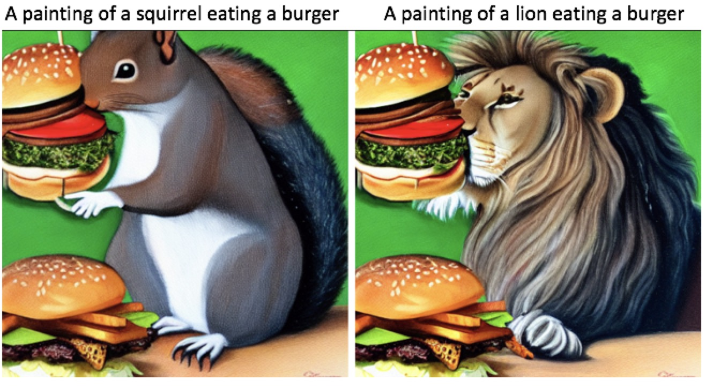
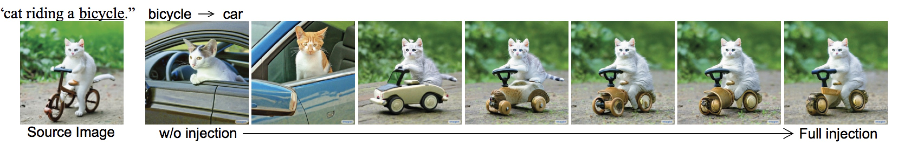

We use the code for [prompt-to-prompt](https://prompt-to-prompt.github.io/) to analyze the attention in stable diffusion.

# Visualize Cross-Attention 

The way to visualize cross-attention between word tokens and image feature map is shown as follows

Visualization exampels:

# no local control for vanilla stable diffusion

We repalce 'squirrel' with 'lion' in the input prompot, there is no local control on the generated images even with same random seed. A small modification of the text prompt often leads to a completely different outcome.

My own ayalysis: the early steps in the decoding process control the global structure of the generated image. The input is a sample nosie feature, we do the cross attention map between it (actuall it's feature map after Conv) and tokens. The size of the attention map is N x 77 (77 is the length of the words tokens.). When we replace 'squirrel' with 'lion', if we consider the first cross attention, the vector multiplication between unchanged tokens and features is not changed, actually we replace a column (correspoding to "squirrel") value with new values. Eventhough we only change a single column, but if we consider each row, many pixels most attended words are changed. Then this change in the first step is enlarged by following decoding steps.

# cross attention edit for control

### 1. replacement edit
In order to only change the replaced word region, prompt-to-prompt propsed to use the original attention map to swap with the new attention map (following figure). For previous example, the region attend to "squirrel" will attend to 'lion', and the location of the region keep changed. Thats why it can do local replacement edit.

The replacement edit results:

**One issue**: look at burgers, they are also changed when we only want to change squirrel to lion. We use the original attention map for cross attention and only the 'squirrel' region should changed to 'lion'. But we have other operations, like the convlution (also self attention), conv has gredually increasing receptive field. Even we only changed the 'squirrel' region for the feature after cross atteion, it also has small affects for other regions due to large receptive field of following convlution and self-attention operations. 

There is one smart and easy soluiton was proposed in prompt-to-prompt (Algorithm 1 L11-14). Using the attention map as mask, and then use the origianl feature map values for the regions that we don't want to edit (like burgers). The updated result is showed as follows. Since the mask  used is not 100% accurate, burgers are not 100% unchanged. But much better than before.

The edit operations can be applied to from 0% layers and 100% layers. The following image is from the original paper:

### 1. Refinement edit

