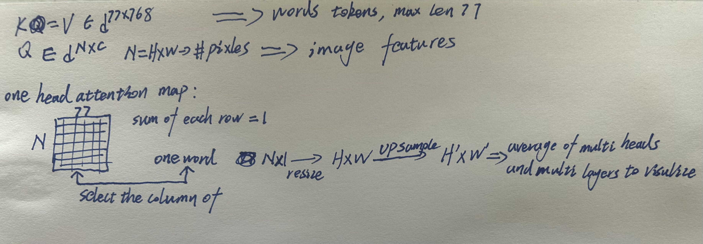
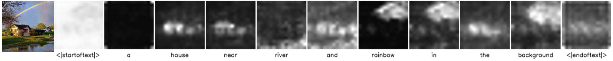

We use the code for [prompt-to-prompt](https://prompt-to-prompt.github.io/) to analyze the attention in stable diffusion.

## Visualize Cross-Attention 

The way to visualize cross-attention between word tokens and image feature map is shown as follows

Visualization exampels:

